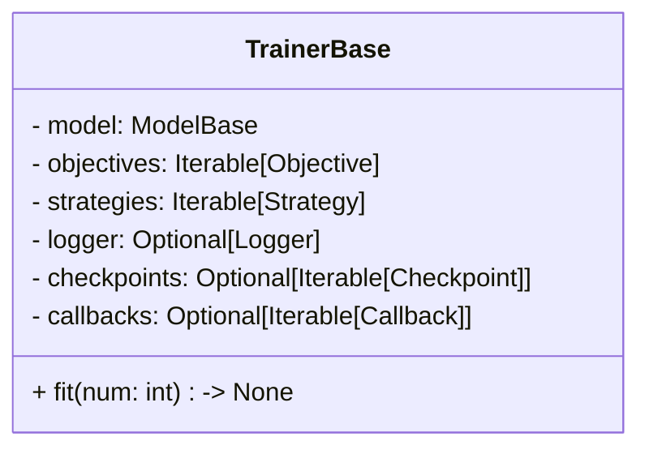
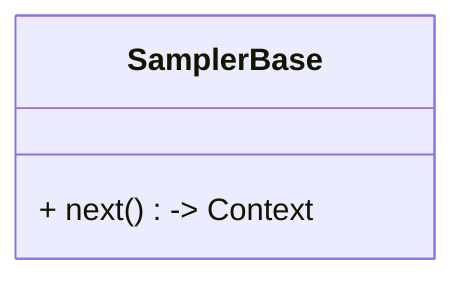
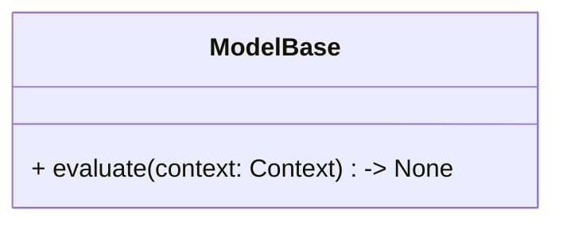
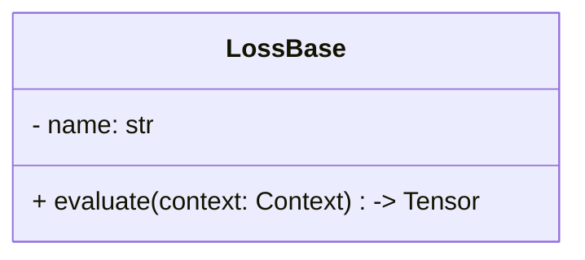
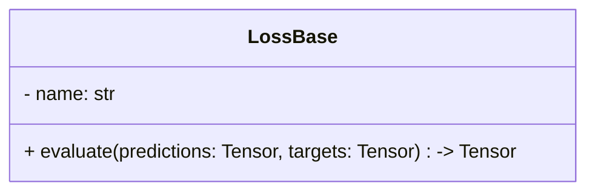
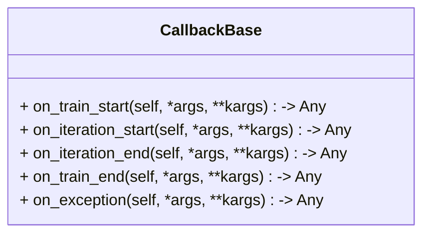
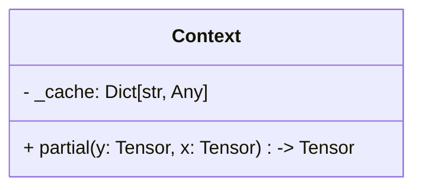
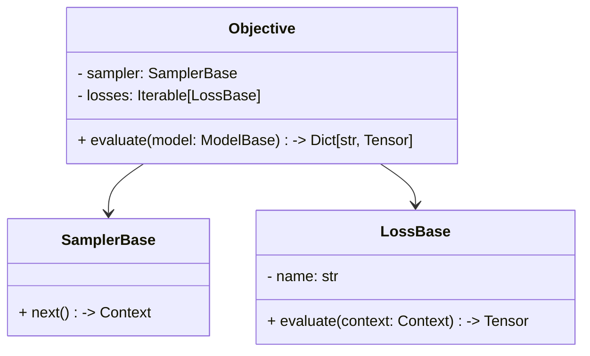
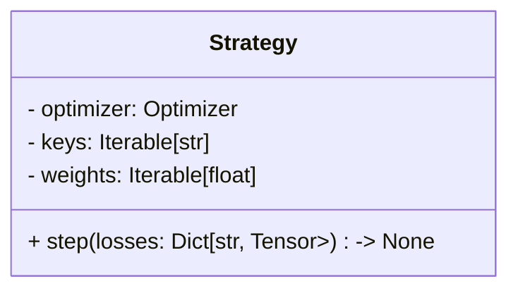

# Core

O módulo `core` define a arquitetura central da biblioteca seguindo princípios de orientação a objetos. Ele reúne as classes abstratas e as implementações responsáveis pela comunicação entre os diferentes componentes do treinamento. Em vez de concentrar toda a lógica de treinamento em um único objeto, o processo é dividido em componentes independentes que colaboram entre si. Essa organização facilita a reutilização de código, a implementação de novas funcionalidades e a personalização do treinamento para diferentes aplicações.

De forma geral, o treinamento pode ser dividido nas seguintes etapas:

- **Etapa 1:** um conjunto de dados são amostrados para a iteração atual utilizando um *Sampler*.

    - As informações do *Sampler* são armazenadas em um objeto *Context* que representa o estado de avaliação atual.

- **Etapa 2:** um *Model* recebe o contexto e calcula a saída da rede neural. O resultado é armazenado no próprio contexto da iteração.

- **Etapa 3:** o contexto, após ser alterado pelo *Model*, é enviado para o uma lista com objetos *Loss*, cada um responsável por calcular uma parcela da função objetivo.

    - As etapas 1, 2 e 3 podem ser entendidas pelo fluxograma abaixo:
    ```mermaid
    flowchart LR
        Sampler -->|Context| Model
        Model -->|Context| Loss
    ```

- **Etapa 4:** um objeto *Strategy* minimiza a função objetivo a partir das losses calculadas anteriormente.

Todas as etapas descritas acima são coordenadas pelo *Trainer*.

## Classes Abstratas

O módulo `core` é composto por um pequeno conjunto de classes abstratas que definem a estrutura da biblioteca e por algumas implementações responsáveis pela comunicação entre os diferentes componentes. As classes abstratas

### TrainerBase

O `TrainerBase` é responsável por orquestrar o processo de treinamento. Seu papel é coordenar a execução dos demais componentes, sem implementar detalhes específicos do problema ou da estratégia de otimização.

O diagrama de classes é definido por:



O `TrainerBase` recebe o modelo, uma coleção de objetivos e uma ou mais estratégias de otimização, além de componentes opcionais como callbacks, loggers e checkpoints. O método `fit(.)` é responsável pelo treinamento da rede neural.

### SamplerBase

O `SamplerBase` define como os dados utilizados durante o treinamento são obtidos. Diferentes implementações podem realizar amostragem uniforme, Latin Hypercube Sampling, amostragem adaptativa, entre outras estratégias.

O diagrama de classes é definido por:



O método `next()` retorna o contexto da iteração atual, na qual contém as entradas e, se aplicável, a saída esperada da rede neural.

### ModelBase

O `ModelBase` representa o modelo treinável. Ele armazena os parâmetros da rede neural e calcula suas saídas a partir das informações disponíveis no contexto.

O diagrama de classes é definido por:



O `ModelBase` avalia o contexto atual a partir do método `evaluate(.)` para calcular os parâmetros necessário. Todas as informações são salvas no contexto.

### LossBase

O `LossBase` define uma parcela da função objetivo. Cada implementação recebe o contexto da avaliação e retorna um valor escalar correspondente à perda calculada.

O diagrama de classes é definido por:



O `LossBase` possui além do método `evaluate(.)`, que calcula a parcela da função objetivo, um nome associado, necessário para identificação.

### MetricBase

O `MetricBase` define uma métrica a partir de uma saída esperada e outra calculada pela rede neural. 

O diagrama de classes é definido por:



O `MetricBase` possui além do método `evaluate(.)`, um nome associado, necessário para identificação.

### Callback

Os callbacks permitem executar ações durante o treinamento, como registrar métricas, salvar checkpoints, alterar hiperparâmetros ou interromper o treinamento de acordo com algum critério.

O diagrama de classes é definido por:



Os métodos descritos acima são avaliados em instantes diferentes do processo iterativo. As entradas e saídas de cada são especificadas de acordo com a implementação desejada, seja, por exemplo, um *Logger* ou *Checkpoint*.

## Classes de integração

Além das classes abstratas, o módulo possui algumas implementações responsáveis pela comunicação entre os diferentes componentes.

### Context

O `Context` representa o estado da avaliação atual. Ele é gerado pelo `SamplerBase` e compartilhado com o `ModelBase` e as diferentes funções de perda. Todos os dados são acessados e adicionados pelo nome da variável, como um dicionário.

O diagrama de classes é definido por:



Inicialmente, o contexto contém apenas os dados gerados pelo `SamplerBase`. Durante a avaliação do modelo, novas informações são adicionadas, como as saídas da rede neural e quantidades calculadas sob demanda, por exemplo derivadas parciais. Dessa forma, diferentes funções de perda podem reutilizar resultados previamente calculados sem necessidade de recomputação.

### Objective

Um `Objective` representa uma função objetivo composta por um processo de amostragem e um conjunto de funções de perda.

O diagrama de classes é definido por:



Cada objetivo utiliza um único `SamplerBase` para gerar os dados da iteração e uma coleção de objetos `LossBase` para calcular as diferentes parcelas da função objetivo.

### Strategy

A classe `Strategy` define como as perdas calculadas serão utilizadas para atualizar os parâmetros do modelo.

O diagrama de classes é definido por:



A implementação padrão combina um conjunto de perdas utilizando pesos definidos pelo usuário e realiza uma etapa de otimização com um único otimizador. Entretanto, essa classe pode ser estendida para implementar estratégias mais sofisticadas, como múltiplos otimizadores, treinamento alternado de diferentes redes neurais ou atualização dinâmica dos pesos das perdas.

Os detalhes de implementação de cada classe são apresentados nas páginas específicas da documentação. Este capítulo tem como objetivo apenas apresentar a arquitetura geral da biblioteca e a responsabilidade de cada componente.